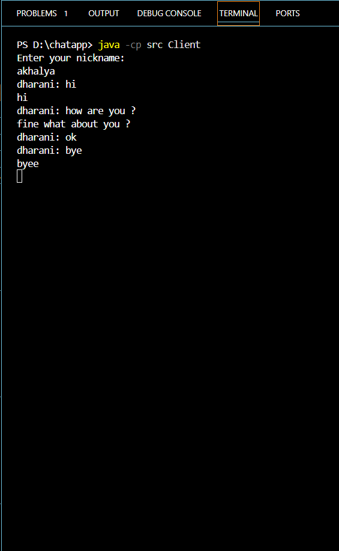

# Elevate-Labs-Intern :
# 📨 Java Console Chat Application

## 📌 Project Overview
This is a simple **real-time peer-to-peer chat system** built using **Java, Socket Programming, and Threads**.  
The application runs entirely in the console (no GUI) and supports:

- ✅ Multi-client chat rooms  
- ✅ Group messaging  
- ✅ Private messaging using `yourname`  
- ✅ User nicknames  
- ✅ Connection/disconnection logs  
- ✅ Basic message encryption (Caesar Cipher)

---
## Screenshot:

## 🛠️ Tech Stack
- **Language:** Java  
- **Core Concepts:** Socket Programming, Multithreading, Encryption  
- **Encryption:** Simple Caesar Cipher (+3 shift)  

---

## 🚀 How to Run

### 1️⃣ Compile the code
Open terminal in the **project root folder** and run:
javac src/*.java 
java -cp src Server [output] Server started on port 12345

Open new terminals (one per client) and run:
java -cp src Client
open new terminal as you need 
